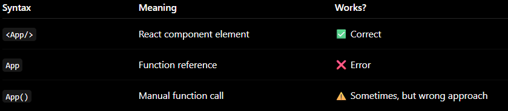
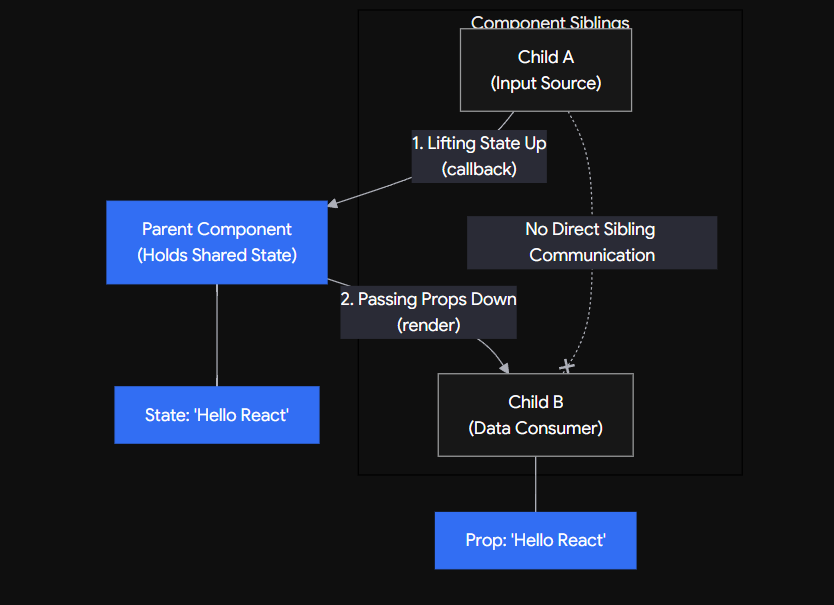
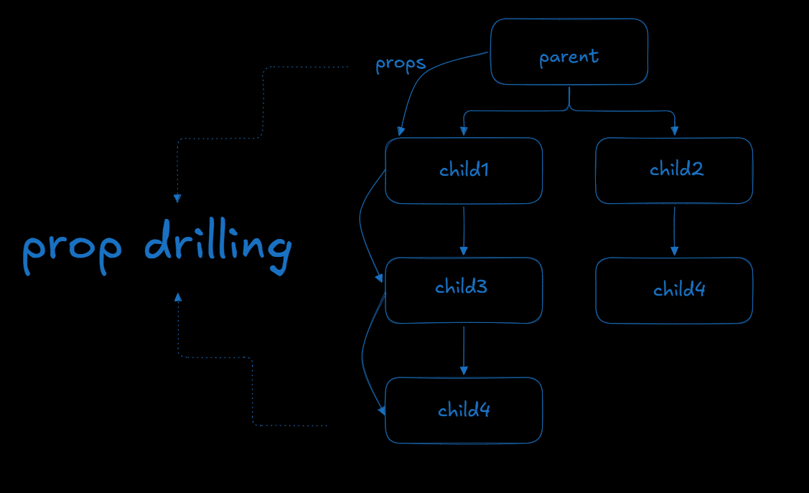

  
# State UpLifting-
>You take the useState out of the child component, and you move it UP into the closest common Parent component.
  

  
if we use state uplifting if we have multiple children but only the lowest one uses that prop even if the others are not using that state variable a change in that will lead to rerendering of all the child even with the use of React.memo()

  
# So to prevent that rerendernig we make a global file and use the useContext hook along with createContext
  
## The variable you create using createContext() MUST start with a Capital Letter (PascalCase).

>❌ Bad: const globalContext = createContext();

>✅ Good: const GlobalContext = createContext();

  
## to be able to get the updated value we have to wrap in the GlobalContext.Provider