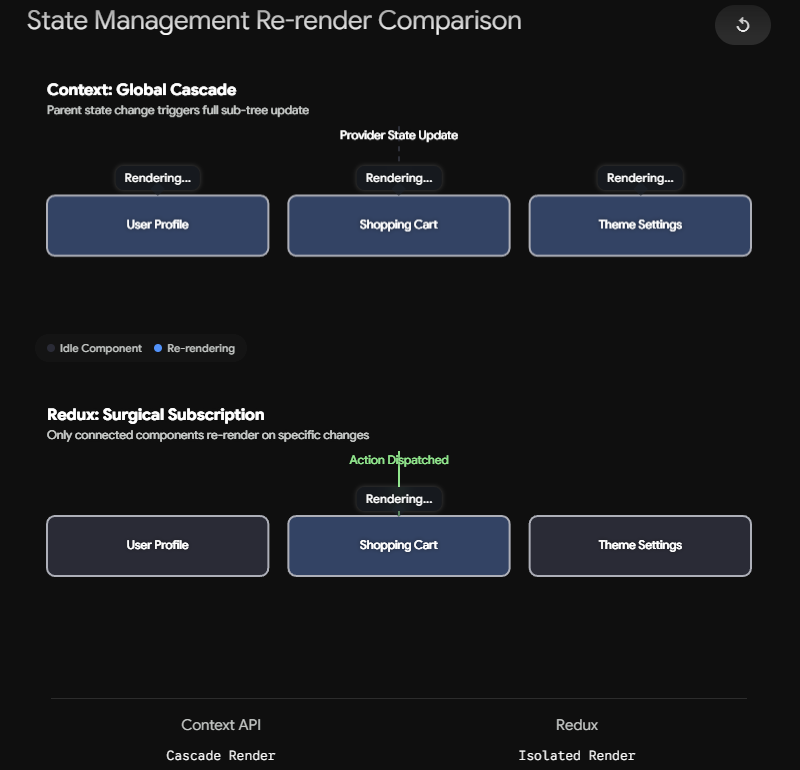

Modern Redux abandons the messy, single-file state management of the past in favor of isolated, domain-specific logic blocks.

- **Slices (`createSlice`):** The "Departments" of the Redux Store. A slice automatically generates actions and reducers for a specific feature (e.g., `authSlice`, `themeSlice`). This prevents naming collisions and keeps state strictly modular.
- **Reducers:** The pure functions living safely inside the Store that actually perform the logic and mutate the state based on the actions they receive.
- **Dispatch (`useDispatch`):** The communication bridge. Components use this hook to send Action payloads to the Store. Components _never_ invoke Reducers directly.

# Why we needed Redux when we had context api?

