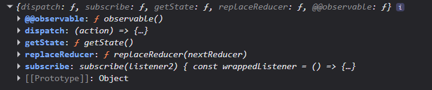

# The Store object created using  
```
const store=configureStore({
    reducer:{
        slice1:reducerSlice1,
    }
})
```
  
1. here subsribe means when we use useSelector hook from the react-redux library ex.
`const count=useSelector((state)=>state.slice1.count)` 
2. dispatch is basically the function we use to perform actions `const dispatch=useDispatch();`  
### When you click the button:

>`Increment` is an Action Creator function. When you call it by writing `Increment()`, it does absolutely no math.It just executes and returns a tiny **Object**: `{ type: 'slice1/Increment' }`.

>`dispatch()` takes that object like a mail carrier and delivers it to the global Redux Store.

>The Redux Store looks at the object, sees the type is "slice1/Increment", and says, "Ah! I need to run the slice1 reducer logic for Increment!"

>The Store runs the reducer in the background securely, updates the state, and tells useSelector to update your UI.  
## Immer.js: The "Mutation" Magic in Redux Toolkit
>Redux requires state to be strictly immutable (you cannot change it directly; you must return a brand new copy). Historically, this led to messy, hard-to-read code using endless spread operators (...state).

>Redux Toolkit solves this by integrating **Immer** under the hood. **Immer** allows you to write code that looks like standard mutable JavaScript, while safely handling the immutable updates behind the scenes.  
### How it works: The "Draft" State
>When you update state inside a Redux Toolkit createSlice reducer, you aren't actually modifying the real state.

>**Immer** wraps your state in a special JavaScript Proxy object called a Draft.

>You write standard code to "mutate" this draft directly (e.g., state.count += 1).

>Once the reducer finishes, **Immer** safely takes your modified draft and compiles it into a brand new, immutable state object for the Redux store.
#### Earlier Code  without Immer
`
Increment:()=>{return {...state,count=state.count+1}};
`  
#### Modern Code  with Immer
`
Increment:(state)=>{state.count=state.count+1}
`   
>here payload is basically argument
  
