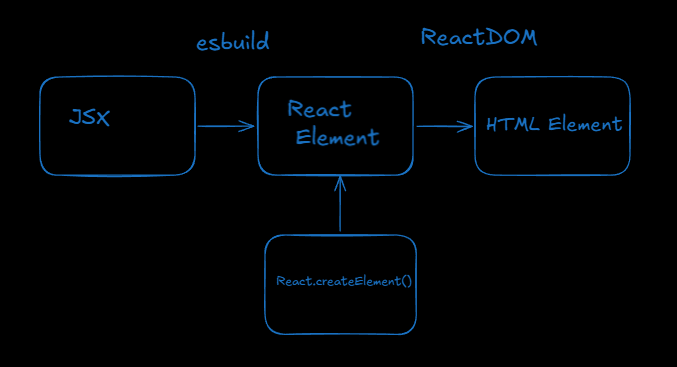

ESLint: Hey bro, your code is messy and might cause a bug.

esbuild: I don't care, I'm just translating this JSX into normal JS so the browser can read it right now.

React.createElement=>react element(JS object);

Compiler: Translates source code from a high-level language to a low-level
Transpiler: Translates source code from one high-level language to another high-level language(Babel)