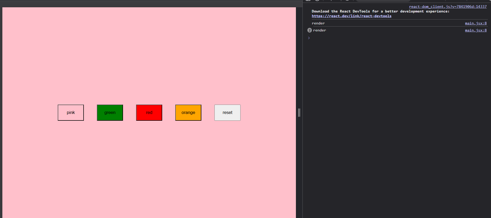

# The state funciton don't calls itself or anything that was just for visualization
  
## State updates are Asynchronous i.e. React does not instantly stop the function, change the screen to white, and restart the component.  

Capitalizing a function is just a signal to the JSX compiler.

Using <Buttons /> tells the compiler to use React.createElement(), which officially registers the component with React's memory engine.

Using Buttons() is just a raw JavaScript call that skips the registration process, causing useState to panic because it has no memory slot assigned to it.  

## by the use opf buttons esbuild doesnot convert the things inside the component to a react element andn when this happens react reaches the useState decalaration but since it now under a react element it doesnt know about that hence giving error 

here react render primitive datatypes twice but if we click again it stops from re-rendering
  
but in case of non-primitive datatypes it calls only one and this happens coz objects are passed by reference 
  
# useEffect is executed at the last  

# When to use it
## To synchronize your React component with an External System.
## What is an "External System"? Anything that React doesn't directly control:
## The Browser's Hard Drive: Saving to localStorage (like we did with the colors).
## The Global Browser Window: Adding a window.addEventListener to track mouse movements.
## The "Outside" DOM: Changing document.body or document.title.
## The Internet (APIs): Fetching data from a backend server database.
## Timers: Setting up a setInterval or setTimeout.
    
# React.memo prevent data from re-rendering if theres no change in props/data 
## we should not use this a lot until the parent is rerendering a lot of time other wise it will cause an overhead(the coder that comes with React.memo)
  
# If it lives in React's house (the UI inside your #root div), use useState.
# If it lives outside React's house (APIs, timers, the browser window, local storage), use useEffect.